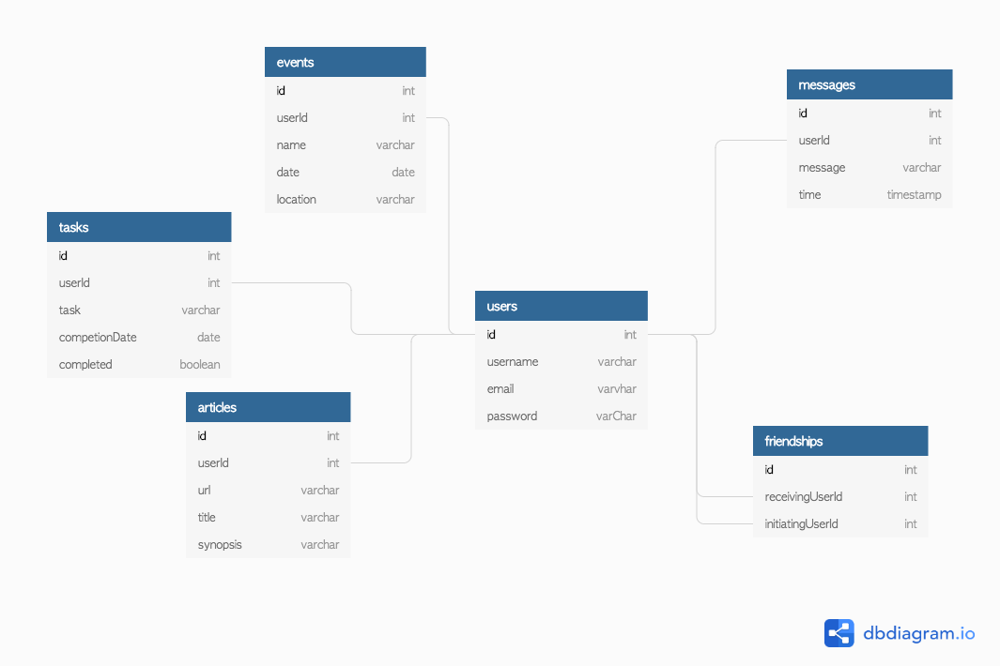

# Nutshell: The Information Dashboard

## Setup: 

1. Clone this repository
1. `cd` into the directory it creates
1. `cd` into the `api` folder to begin running server
1. `cd` into the `src` directory
1. Run `hs -o .` to verify everything works

## Summary

Nutshell is a a dashboard for people to use to organize their daily tasks, events, news article, friends, and chat messages.

## Skills and Concepts Used

1. Functions
1. Databases/API ([JSON Server Documentation](https://github.com/typicode/json-server))
1. Github
1. Objects
1. CSS/Flexbox
1. Array methods
1. Handling user events
1. Factory functions
1. Implementing CRUD operations
1. Modular code with Webpack
1. Relational data

## Professional Requirements

1. Each module should have a comment at the top with the following info: author(s) and purpose of module
1. The README for your project should include instructions on how another person can download and run the application
1. An ERD showing the database relationships. A screenshot/image should be included on your README.

## Handling Authentication

Nutshell will be using session storage to keep track of which user has logged into Nutshell. When the user fills out the registration form their username and password will POST to the `users` collection in the API. Afterward, the `id` of the object in the response will be saved to session storage.

## Database Diagram 
